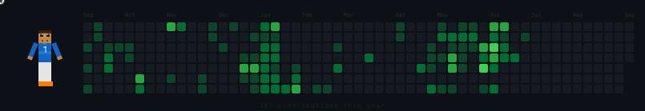

<div align="center">

<!-- Typing banner -->


</div>

```
  Roman Nihal
  ─────────────────────────────────────────────────────────
  Role       ->  Junior AI Engineer @ Betopia Limited
  Domain     ->  ML | LLMs | Computer Vision | Backend
  Stack      ->  Python | FastAPI | LangChain | YOLO | OpenCV
  Currently  ->  [REDACTED - ask me]
  Status     ->  building something. always.
```

---

### How I think

I look for edge cases before I look for solutions. My first instinct with any problem is to ask *what breaks this?* - then work backward to something that doesn't.

I'm not a "finish the tutorial and move on" kind of person. If something doesn't make sense to me internally, I'll rebuild it from scratch until it clicks. That's also why I explore new AI techniques the moment I hear about them - I need to know if they actually hold up in the real world.

Frontend? I'll build it if I have to (and sometimes do, with AI). But I'd rather be the one making the decisions that actually matter: how the model behaves, how the pipeline holds, how the system handles what nobody tested.

---

### What I'm working with

<div align="center">

</div>

<table>
  <tr>
    <td><b>AI / ML</b></td>
    <td>
      
      
      
    </td>
  </tr>
  <tr>
    <td><b>Computer Vision</b></td>
    <td>
      
      
    </td>
  </tr>
  <tr>
    <td><b>LLMs / GenAI</b></td>
    <td>
      
      
    </td>
  </tr>
  <tr>
    <td><b>Backend</b></td>
    <td>
      
      
    </td>
  </tr>
</table>

---

### Currently building

```
  [ACTIVE]   Something at Betopia Limited - not public yet.
  [TESTING]  A technique I found last week. Not sure if it holds up.
  [WATCHING] LLM agent reliability in production. Still skeptical.
  [NEXT]     -
```

---

### Activity

<div align="center">


</div>

---

### Find me

<p align="center">
  <a href="https://romannihal.github.io/Portfolio/">
    
  </a>
  &nbsp;
  <a href="https://www.linkedin.com/in/romannihal/">
    
  </a>
  &nbsp;
  <a href="https://www.kaggle.com/romannihal">
    
  </a>
  &nbsp;
  <a href="mailto:nihalroman7@gmail.com">
    
  </a>
</p>

<div align="center">
<sub>open to collaborations on ML · LLMs · Computer Vision - if the problem is interesting</sub>
</div>
